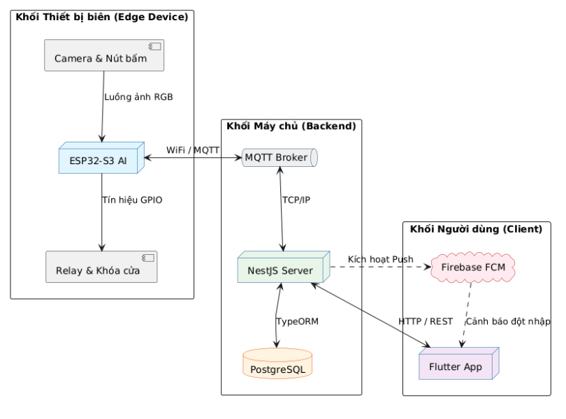
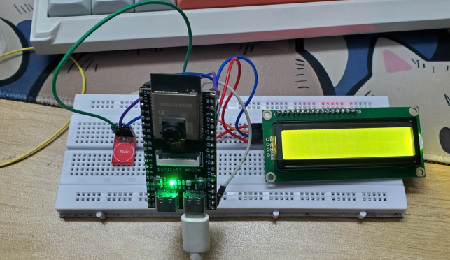

# HỆ THỐNG KHÓA CỬA THÔNG MINH TÍCH HỢP AI NHẬN DIỆN VÀ CHỐNG GIẢ MẠO KHUÔN MẶT

## GIỚI THIỆU

__Đề bài/Mục tiêu sản phẩm__: Xây dựng một hệ thống khóa cửa thông minh (Smart Lock) ứng dụng công nghệ AI để nhận diện khuôn mặt và chống giả mạo (Liveness Detection), khắc phục các điểm yếu của khóa cửa truyền thống (chìa khóa cơ, thẻ từ RFID, mật khẩu) vốn dễ bị đánh cắp, sao chép hoặc thất lạc. Hệ thống hướng tới giải quyết lỗ hổng bảo mật phổ biến ở các khóa thông minh giá rẻ hiện nay: chỉ so khớp đặc trưng khuôn mặt 2D mà thiếu cơ chế kiểm tra tính sống, dễ bị đánh lừa bởi ảnh tĩnh hoặc video phát trên màn hình điện thoại.

__Hướng tiếp cận__: Hệ thống được thiết kế theo mô hình phân tán, khép kín gồm 3 khối chính:
- **Thiết bị biên (Edge Device – ESP32-S3)**: thu nhận hình ảnh qua camera, chạy trực tiếp mô hình AI (TinyML/TensorFlow Lite for Microcontrollers) để phát hiện khuôn mặt, kiểm tra tính sống (Liveness Detection) nhằm phân biệt khuôn mặt thật 3D với ảnh phẳng 2D, sau đó mới thực hiện nhận diện đặc trưng khuôn mặt (Face Recognition) và điều khiển Relay mở khóa.
- **Máy chủ trung tâm (Backend – NestJS)**: đóng vai trò trung gian xử lý luồng dữ liệu, xác thực qua giao thức MQTT (Publish/Subscribe), lưu trữ dữ liệu vào PostgreSQL và kích hoạt thông báo đẩy qua Firebase Cloud Messaging khi có sự kiện bất thường.
- **Ứng dụng di động (Mobile App – Flutter)**: giao diện tương tác theo kiến trúc MVVM, cho phép người dùng theo dõi trạng thái khóa theo thời gian thực, xem nhật ký ra vào và nhận cảnh báo đột nhập khẩn cấp.

Việc xử lý AI được thực hiện cục bộ ngay trên vi điều khiển (Edge AI) thay vì trên đám mây, giúp giảm độ trễ và tránh rủi ro rò rỉ dữ liệu cá nhân (hình ảnh khuôn mặt) ra bên ngoài.

__Sản phẩm:__
1. Nhận diện khuôn mặt kết hợp chống giả mạo (Liveness Detection) chạy trực tiếp trên ESP32-S3, thời gian phản hồi từ lúc quét mặt đến khi mở khóa khoảng 1.2 – 1.5 giây.
2. Màn hình LCD I2C và nút bấm vật lý hiển thị trạng thái tại chỗ.
3. Đồng bộ dữ liệu và cảnh báo an ninh thời gian thực qua MQTT Broker (Mosquitto) và máy chủ NestJS.
4. Cảnh báo đột nhập tức thời (dưới 1 giây) qua Push Notification (Firebase FCM) khi số lần nhận diện sai vượt ngưỡng cho phép.
5. Ứng dụng di động SecureHome (Flutter) quản lý khóa, thành viên, xem nhật ký ra vào (Access Logs) và nhận cảnh báo, hỗ trợ Pull-to-refresh để cập nhật trạng thái Online/Offline khi mạng chập chờn.

## MÔI TRƯỜNG HOẠT ĐỘNG

- Vi điều khiển: **ESP32-S3** (2 nhân xử lý, hỗ trợ PSRAM ngoài để nạp mô hình TFLite).
- Nền tảng máy chủ: **Node.js / NestJS**, cơ sở dữ liệu quan hệ **PostgreSQL** (kết nối qua TypeORM).
- Giao thức truyền thông: **MQTT** (Mosquitto Broker).
- Hệ điều hành thời gian thực: **FreeRTOS** (phân luồng đa nhân trên ESP32-S3).
- Ứng dụng di động: **Flutter** đa nền tảng, kiến trúc **MVVM**, quản lý trạng thái bằng **GetX**.
- Dịch vụ đẩy thông báo: **Firebase Cloud Messaging (FCM)**.

**Bill of materials**

|STT|Tên linh kiện|Ý nghĩa|
|--:|--|--|
|1|ESP32-S3|Vi điều khiển trung tâm, chạy AI cục bộ (Face Detection, Liveness Detection, Face Recognition)|
|2|Camera Module (RGB565)|Thu nhận luồng ảnh đầu vào cho xử lý AI|
|3|Màn hình LCD I2C|Hiển thị trạng thái cục bộ tại thiết bị|
|4|Nút bấm vật lý (PULLUP/PULLDOWN)|Tương tác cục bộ, chống nhiễu tín hiệu (Floating Pin)|

## SƠ ĐỒ SCHEMATIC

Hệ thống được nối theo mô hình phân tán 3 khối, thể hiện qua sơ đồ kiến trúc tổng thể:

- **Khối Thiết bị biên (Edge Device):** Camera & Nút bấm → luồng ảnh RGB → ESP32-S3 AI (xử lý Face Detection → Liveness Detection → Face Recognition) → tín hiệu GPIO → Relay & Khóa cửa.
- **Khối Máy chủ (Backend):** ESP32-S3 giao tiếp WiFi/MQTT với MQTT Broker → NestJS Server (qua TCP/IP) → lưu trữ qua TypeORM vào PostgreSQL.
- **Khối Người dùng (Client):** NestJS Server kích hoạt Push qua Firebase FCM → gửi cảnh báo đột nhập (HTTP/REST) tới Flutter App.

## TÍCH HỢP HỆ THỐNG

**Phần cứng:**

- **ESP32-S3 (Thiết bị biên):** thu nhận hình ảnh, chạy suy luận AI cục bộ, điều khiển Relay mở khóa. Firmware phân luồng bằng FreeRTOS:
  - *Core 0 (Network Task):* duy trì kết nối WiFi và vòng lặp MQTT; dữ liệu gửi đi qua hàng đợi (Tx Queue) chống tràn bộ nhớ; nếu rớt mạng, log cảnh báo lưu tạm vào flash (SPIFFS) và đẩy bù khi có mạng trở lại.
  - *Core 1 (AI & Camera Task):* đọc frame ảnh và suy luận AI theo 3 bước Face Detection → Liveness Detection → Face Recognition.

**Phần mềm:**
- **Backend (NestJS + PostgreSQL):** xử lý nghiệp vụ trung tâm, quản lý luồng thông điệp MQTT, lưu trữ thiết bị/người dùng/nhật ký truy cập. Cơ sở dữ liệu gồm các bảng chính: `users`, `devices`, `face_profiles`, `device_shares`, `device_profile_access`, `access_logs`.
- **MQTT Broker (Mosquitto):** trung gian truyền thông điệp Publish/Subscribe giữa thiết bị biên và Backend.
- **Firebase Cloud Messaging:** đẩy thông báo khẩn cấp (priority "high") tới ứng dụng di động khi có cảnh báo đột nhập.
- **Mobile App (Flutter, MVVM + GetX):** lớp View chỉ lắng nghe trạng thái từ ViewModel, không xử lý logic trực tiếp; tích hợp Pull-to-refresh để cập nhật danh sách thiết bị và trạng thái Online/Offline.

## KẾT QUẢ

- **Tốc độ phản hồi:** thời gian từ lúc quét mặt đến khi kích hoạt Relay dao động trong khoảng 1.2 – 1.5 giây, đáp ứng trải nghiệm mượt mà.
- **Độ chính xác và bảo mật:** hệ thống từ chối hoàn toàn các thử nghiệm sử dụng hình ảnh tĩnh hoặc màn hình điện thoại nhờ mô hình Liveness Detection; cảnh báo đột nhập hiển thị trên app dưới 1 giây.
- **Độ ổn định mạng:** cơ chế MQTT Queue kết hợp SPIFFS chứng minh hiệu quả trong việc chống phân mảnh RAM và ngăn chặn lỗi sập nguồn (Guru Meditation Error).
- **Giao diện ứng dụng di động SecureHome:** màn hình Quản lý khóa (Dashboard) hiển thị tổng quan trạng thái khóa (Online/Offline), và màn hình Nhật ký hoạt động (Activity) hiển thị lịch sử ra vào theo thời gian thực.

**Hạn chế còn tồn tại:**
- Giới hạn RAM nội bộ của ESP32 (512KB) bị chiếm dụng bởi RTOS và Socket mạng, chưa cho phép render trực tiếp luồng video camera lên màn hình TFT.
- Độ chính xác của Liveness Detection (dựa trên ảnh RGB) có thể suy giảm trong điều kiện ngược sáng mạnh hoặc thiếu sáng.

**Hướng phát triển tương lai:**
- Tích hợp IC điều khiển màn hình độc lập (TFT SPI có Frame buffer riêng) để giảm tải CPU và cung cấp giao diện trực quan hơn.
- Nâng cấp Camera kép (IR + RGB): kết hợp phổ quang học và bản đồ chiều sâu hồng ngoại để đạt độ tin cậy chống giả mạo tuyệt đối trong mọi điều kiện ánh sáng.
